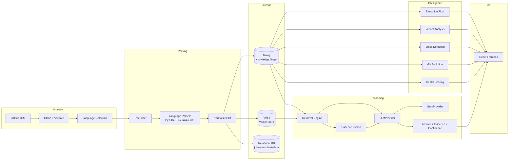

# CodeSage — Roadmap & Milestone Plan

> **CodeSage is an AI-powered software architecture intelligence platform.**
> It is not a "chat with your code" wrapper — it is a system where a deterministic
> knowledge graph is the source of truth, and the LLM explains and reasons over that
> graph. This document defines how we get there in verifiable, demo-able increments.

Source of requirements: [`CLAUDE.md`](../CLAUDE.md) (project constitution — all decisions
below are traceable to it).

---

## 1. Guiding Principles

These constraints shape every milestone and are non-negotiable without re-evaluating
the whole plan:

1. **Graph over guesswork** — structural facts (calls, imports, inheritance) come from
   Tree-sitter + Neo4j, never from LLM inference alone.
2. **Evidence-backed answers** — every AI claim ships with file/line/commit evidence and
   a deterministically computed confidence label (`Confirmed` / `Inferred` / `Uncertain`).
3. **Language-agnostic core** — Python, JavaScript, TypeScript, Java, C++ all normalize
   into one Intermediate Representation (IR); no per-language forks in the analysis layer.
4. **LLM is replaceable** — all reasoning goes through an `LLMProvider` abstraction
   (`GrokProvider` today); nothing calls the Grok API directly from business logic.
5. **Build vertically** — a thin, working end-to-end slice (GitHub → parse → graph →
   answer) before breadth (more languages, more analyses).
6. **Untrusted input everywhere** — repository content (code, comments, READMEs) is
   never treated as system instructions; strict prompt boundaries at all times.

---

## 2. Target Architecture (end state)

---

## 3. Technology Stack

| Layer | Choice | Notes |
|---|---|---|
| Backend | Python, FastAPI, Pydantic | async where appropriate |
| Parsing | Tree-sitter | one grammar per supported language |
| Graph DB | Neo4j | structural source of truth |
| Vector store | FAISS | abstracted behind a `VectorStore` interface, swappable later |
| LLM | Grok API | behind `LLMProvider` → `GrokProvider` |
| Git | GitPython / subprocess | history, diffs, authorship |
| Frontend | React + TypeScript | Cytoscape.js (or equivalent) for graph viz |
| Jobs | Local worker (v1) → Celery/RQ/Dramatiq-ready interface | analysis runs in background, not in-request |
| Deployment | Docker + Docker Compose | local-first |
| Relational metadata | Postgres (proposed) | users, repositories, job status, settings — kept separate from Neo4j |

**Supported languages (fixed scope):** Python, JavaScript, TypeScript, Java, C++ — in that
implementation order. No other language is added without an explicit scope change.

---

## 4. Milestone Plan

Milestones are grouped into four **Phases** for presentation purposes; each Phase ends
with something demo-able. Duration estimates assume a small team (2–3 engineers)
working full-time — treat as relative sizing, not committed dates.

### Phase I — Foundation & MVP
**Exit criterion:** a user pastes a GitHub URL and gets an evidence-backed answer to
*"How does authentication work?"* for a small Python repo.

| # | Milestone | Scope | Deliverables | Est. |
|---|---|---|---|---|
| M0 | Project Setup | Repo scaffold per `CLAUDE.md` §23, FastAPI skeleton, React+TS skeleton, Docker Compose (Neo4j + backend + frontend), config/env management, structured logging | Running `docker compose up` with a health-check endpoint | 1 wk |
| M1 | Repository Ingestion | `GitHubRepositoryService`: URL validation, sandboxed clone, size/file limits, path-traversal & command-injection guards, metadata extraction, language detection, file filtering | Given a URL, repo is cloned into an isolated workspace with metadata persisted | 1–2 wk |
| M2 | Python Parser + IR | Tree-sitter Python grammar; extract files, classes, functions, methods, imports, calls, decorators; normalize into `Symbol`/`Relationship` IR objects | IR produced for a real Python repo, covered by golden-repo tests | 2–3 wk |
| M3 | Knowledge Graph (v1) | Neo4j schema (§6 node/relationship types), IR→graph loader, basic Cypher query layer, minimal graph explorer UI | A parsed repo is browsable as a graph in Neo4j Browser + a simple frontend view | 2 wk |
| M4 | Evidence-Based Q&A (MVP) | Hybrid retrieval (graph + FAISS), `LLMProvider`/`GrokProvider` abstraction, evidence fusion, deterministic confidence scoring, `/ask` endpoint + chat UI | **MVP demo**: ask "How does authentication work?", receive answer + file:line evidence + confidence | 2–3 wk |

**Phase I total: ≈ 8–11 weeks.**

---

### Phase II — Structural Intelligence & Language Breadth
**Exit criterion:** the platform reasons about execution flow, blast radius, and
architectural quality across all five supported languages.

| # | Milestone | Scope | Deliverables | Est. |
|---|---|---|---|---|
| M5 | Language Expansion | JavaScript → TypeScript → Java → C++ parsers, each normalizing to the same IR; golden repos per language | Same graph queries work identically regardless of source language | 5–7 wk (parallelizable across engineers) |
| M6 | Execution Flow Reconstruction | Entry-point detection (API routes), static call-graph traversal, confidence-scored edges, flow visualization | `POST /payment → Controller → Service → Repository → DB` rendered with confidence per hop | 2 wk |
| M7 | Impact & Risk Analysis | Direct/indirect dependents, affected APIs/tests/services, deterministic risk model (LOW/MEDIUM/HIGH/CRITICAL) | "What breaks if I change `PaymentService.process()`?" answered with a scored report | 2–3 wk |
| M8 | Architectural Smell Detection | Circular deps, god classes, high coupling/low cohesion, dead modules, duplicate logic, large functions, missing tests, layer violations | Smell report with severity, evidence, and suggested refactor per finding | 2–3 wk |
| M9 | Repository Health Dashboard | Aggregate explainable scores (architecture, maintainability, coupling, complexity, test coverage) from M6–M8 signals | Health dashboard driven entirely by measured signals, no invented scores | 1 wk |

**Phase II total: ≈ 12–16 weeks.**

---

### Phase III — Temporal & Conversational Intelligence
**Exit criterion:** the platform explains *why* the codebase looks the way it does and
lets a new developer learn it interactively.

| # | Milestone | Scope | Deliverables | Est. |
|---|---|---|---|---|
| M10 | Git Evolution Graph | Commit/diff/author extraction, file & symbol history, commit↔graph linkage, "why" reasoning grounded in commit messages/diffs | "Why does the project use Redis?" answered with commit evidence, or an explicit "no rationale found" | 2–3 wk |
| M11 | Talk to the Codebase | Per-module generated context (purpose, deps, APIs, tests, recent changes, smells), lightweight module-specialist retrieval + synthesis | Cross-module questions get a synthesized answer, not N independent chatbots | 2 wk |
| M12 | AI Onboarding Mode | Repository-driven learning path generation, per-section overview/files/diagram/suggested questions/quiz | "I'm new here" produces a structured, repo-specific onboarding path | 1–2 wk |

**Phase III total: ≈ 5–7 weeks.**

---

### Phase IV — Production Hardening
**Exit criterion:** the platform is safe, observable, and scales past toy repositories.

| # | Milestone | Scope | Deliverables | Est. |
|---|---|---|---|---|
| M13 | Background Processing at Scale | Move analysis fully off the request path, job-queue-ready worker interface, progress streaming to frontend | Repo analysis progress bar (`Cloning ✓ / Parsing ███░░ / ...`) reflects real job state | 1–2 wk |
| M14 | Incremental Analysis | Diff-based reparse on new commits: changed files → updated graph/embeddings/evolution | Pushing a small commit updates the graph without a full re-scan | 2–3 wk |
| M15 | Security & Observability Hardening | Secret redaction, LLM prompt-boundary audit, sandboxed execution review, structured metrics (parse time, token usage, retrieval latency) | Security review checklist passed; dashboards for pipeline health | 1–2 wk |
| M16 | Frontend & UX Polish | Full interactive diagram suite (component/call/dependency/flow views), zoom/pan/search, "ask AI about this node" | Product matches §39 target user journey end-to-end | 2–3 wk |

**Phase IV total: ≈ 6–10 weeks.**

---

## 5. Cross-Cutting Workstreams (run continuously, not phase-gated)

- **Testing** — unit tests per parser/analyzer, integration tests for the full
  retrieval pipeline, and golden test repositories (`test_repositories/simple_python`,
  `circular_dependencies`, `layered_architecture`, `god_class`, `api_service`,
  `git_evolution`) added as each corresponding milestone lands.
- **Security** — path traversal, command injection, secret handling, and prompt-injection
  resistance are reviewed at every milestone touching ingestion or LLM calls, not
  deferred to Phase IV.
- **Documentation** — ADRs (`docs/adr/`) for every non-obvious architectural decision;
  API contracts versioned from M4 onward.

---

## 6. Explicit Non-Goals (current scope)

- No languages beyond Python, JavaScript, TypeScript, Java, C++.
- No execution of arbitrary repository code (build scripts, tests) — analysis is static only.
- No sending full repositories to the LLM — retrieval is always scoped and evidence-based.
- No LLM-invented confidence scores or fabricated commits/files/functions.
- No production-scale monorepo support in v1 (target: repos up to ~5,000 files).

---

## 7. Top Risks & Mitigations

| Risk | Impact | Mitigation |
|---|---|---|
| Tree-sitter grammar gaps produce incomplete IR | Wrong/missing graph edges | Golden-repo regression tests per language; treat "supported" as "reliably extractable," not "parseable" |
| LLM hallucinates relationships graph doesn't support | Loss of trust in evidence-backed claims | Graph is arbiter — LLM claims contradicting the graph trigger investigation, not display, per §44 |
| Neo4j query performance on larger repos | Slow interactive exploration | Start with small/medium repo targets (§41); add query optimization/caching in Phase IV |
| Grok API coupling creeps into services | Hard to swap providers later | Enforce `LLMProvider` abstraction in code review; no direct SDK imports outside `ai/grok/` |
| Scope creep across 5 languages before MVP validated | Delayed feedback on core value prop | Phase I ships Python-only; language expansion is explicitly Phase II |

---

## 8. Immediate Next Steps (Milestone 0 kickoff)

1. Scaffold `backend/`, `frontend/`, `tests/`, `docs/adr/`, `scripts/`, `docker/` per `CLAUDE.md` §23.
2. Stand up `docker-compose.yml` with Neo4j + FastAPI + React.
3. Add `.env.example` (`XAI_API_KEY`, `GROK_MODEL`, Neo4j creds) and confirm `.gitignore` excludes `.env`.
4. Implement health-check endpoints and structured logging baseline.
5. Begin `GitHubRepositoryService` (M1).
